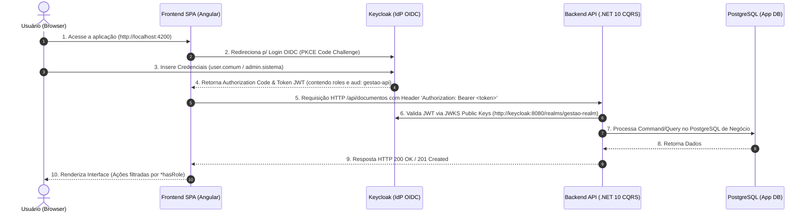

# 🚀 Gestão App - Monorepo (.NET 10, Angular, Keycloak, Docker)


---

## 📋 Visão Geral

Este repositório é uma arquitetura de referência para sistemas corporativos modernos baseados em micro-serviços/monorepos. Ele integra um **Backend .NET 10 com CQRS e DDD**, um **Frontend Angular com Standalone Components**, o **Keycloak Identity Server (OIDC/OAuth 2.0)** e bancos de dados **PostgreSQL** totalmente isolados e containerizados via Docker.

A autenticação é **stateless** baseada em JSON Web Tokens (JWT). O Frontend Angular utiliza o fluxo **OAuth 2.0 Authorization Code com PKCE (S256)** para autenticação de clientes públicos (SPA). Os tokens emitidos contêm declarações de audiência customizadas (`gestao-api`) e perfis de usuário (`realm_access.roles`), que são validados pela API .NET utilizando verificação estrita de assinatura via JWKS do Keycloak.

---

## 📐 Diagrama de Arquitetura



---

## 🛠️ Pré-requisitos

Para executar e desenvolver neste repositório, certifique-se de ter instalado em sua máquina:

- [Docker Desktop](https://www.docker.com/products/docker-desktop/) (com Docker Compose v2)
- [.NET 10 SDK](https://dotnet.microsoft.com/download)
- [Node.js 20+ / npm](https://nodejs.org/)

---

## 🚀 Como Rodar o Projeto (Guia Passo a Passo)

### 1. Subida Completa da Stack via Docker Compose
Navegue até o diretório da infraestrutura e inicie os containers:

```bash
cd infra/docker
docker compose up -d --build
```

Isso subirá automaticamente:
- **`keycloak-db`** (PostgreSQL na porta `5433`)
- **`keycloak`** (Keycloak Server na porta `8080` com importação automática de realm)
- **`app-db`** (PostgreSQL da aplicação na porta `5432`)
- **`backend-api`** (API .NET na porta `5000`)
- **`frontend-spa`** (Angular em container Nginx na porta `4200`)

Para acompanhar o status de inicialização e a saúde dos containers:
```bash
docker compose ps
```

---

## 🔐 Credenciais de Teste

O realm `gestao-realm` é importado automaticamente na subida com os seguintes usuários pré-configurados:

| Usuário | Senha | Roles Atribuídas | Descrição |
| :--- | :--- | :--- | :--- |
| `user.comum` | `user123` | `gestao_user` | Acesso padrão. Pode listar e cadastrar documentos. Botão de exclusão oculto. |
| `admin.sistema` | `admin123` | `gestao_user`, `gestao_admin` | Acesso total. Pode listar, cadastrar e excluir documentos, além de acessar a rota `/admin`. |

- **Painel Administrativo do Keycloak**: [http://localhost:8080](http://localhost:8080)
  - Admin Master: Username: `admin` | Password: `admin`

---

## 📂 Estrutura de Diretórios do Monorepo

```text
gestao-projeto/
├── .gitignore                      # Gitignore unificado do monorepo
├── README.md                       # Documentação principal
├── backend/                        # Backend .NET 10 (Clean Architecture + CQRS)
│   ├── GestaoApp.sln               # Solução C# .NET 10
│   ├── Dockerfile                  # Build Multi-Stage da API .NET
│   ├── Gestao.API/                 # Camada de Entrada, Controllers e Program.cs
│   ├── Gestao.Application/         # Casos de Uso, CQRS (Commands, Queries e Handlers)
│   ├── Gestao.Application.Tests/   # Testes Unitários de Handlers (xUnit + NSubstitute)
│   ├── Gestao.Domain/              # Entidades com Invariantes DDD e Exceções de Domínio
│   └── Gestao.Infrastructure/      # DbContext EF Core, PostgreSQL e Keycloak Claims Transformer
├── frontend/                       # Frontend Angular (Feature-Based + Standalone Components)
│   └── gestao-frontend/
│       ├── Dockerfile              # Build Multi-stage Angular + Nginx
│       ├── nginx.conf              # Configuração Nginx com SPA Routing
│       └── src/app/
│           ├── core/               # Interceptors HTTP, Guards de Autenticação/Roles
│           ├── shared/             # Diretivas Estruturais (*hasRole) e Componentes Reutilizáveis
│           └── features/           # Módulos Funcionais (documentos, admin, auth)
└── infra/                          # Infraestrutura como Código
    └── docker/
        ├── docker-compose.yml      # Orchestrator oficial de toda a stack
        └── keycloak/
            └── realm-export.json   # Exportação automática do Realm Keycloak
```

---

## 🌐 Endpoints da API e Rotas do Frontend

### Backend API (.NET 10) - Base URL: `http://localhost:5000`

| Método | Endpoint | Permissão Exigida | Descrição |
| :--- | :--- | :--- | :--- |
| `GET` | `/api/documentos` | `gestao_user` | Retorna a lista de documentos cadastrados. |
| `POST` | `/api/documentos` | `gestao_user` | Cria um novo documento (atribui o criador via token JWT). |
| `DELETE` | `/api/documentos/{id}` | `gestao_admin` | Remove um documento existente pelo seu GUID. |

### Frontend SPA (Angular) - Base URL: `http://localhost:4200`

| Rota | Guard de Proteção | Permissões Exigidas | Descrição |
| :--- | :--- | :--- | :--- |
| `/documentos` | `authGuard`, `roleGuard` | `gestao_user` | Tela principal de cadastro e visualização de documentos. |
| `/admin` | `authGuard`, `roleGuard` | `gestao_admin` | Painel exclusivo para administradores do sistema. |
| `/access-denied` | Nenhuma | Livre | Tela de erro 403 (Acesso Negado). |

---

## 🧪 Comandos Úteis de Desenvolvimento e Testes

### Executar Testes do Backend (.NET)
```bash
cd backend
dotnet test
```

### Rodar o Backend em Modo de Desenvolvimento Local
```bash
cd backend/Gestao.API
dotnet run
```

### Rodar o Frontend em Modo de Desenvolvimento Local
```bash
cd frontend/gestao-frontend
npm install
npm start
```
